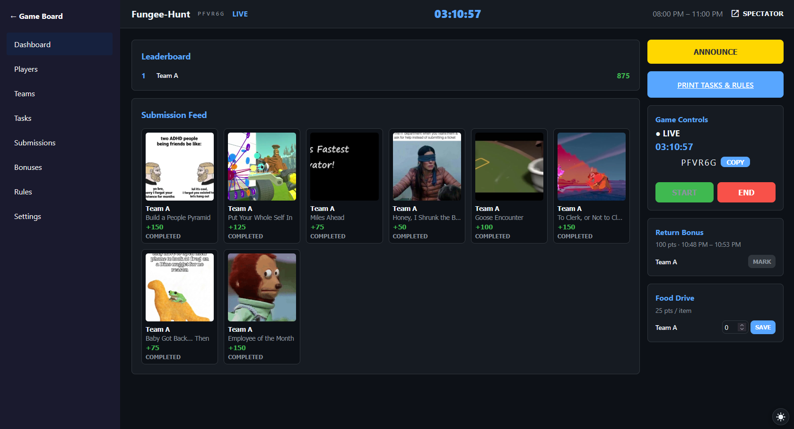
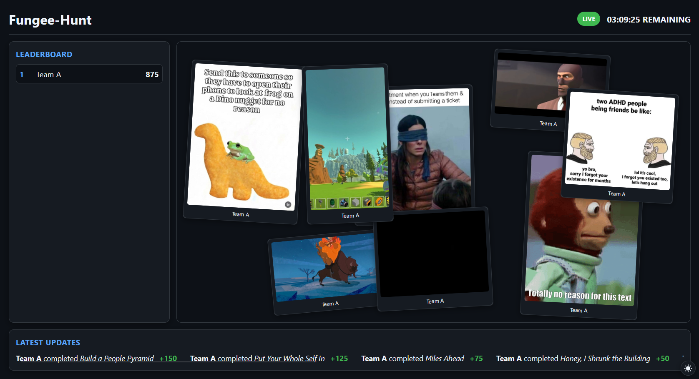
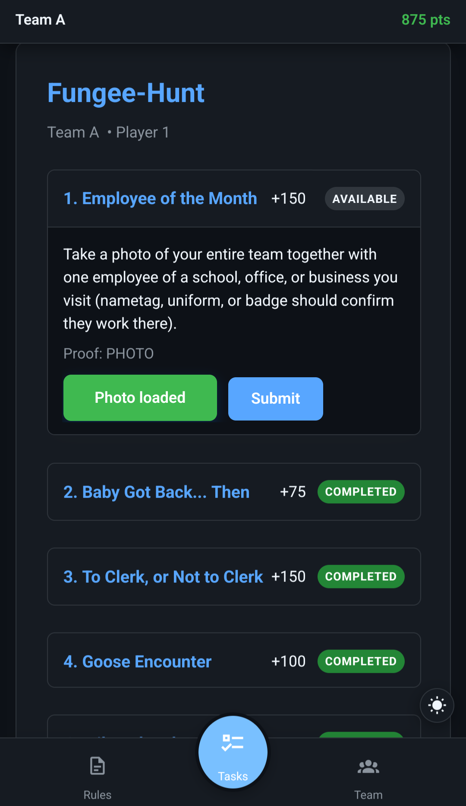

# Fungee-Hunt

A self-hosted scavenger-hunt platform for groups, built for phones, projectors, and everything in between. One Game Master runs the show; players join with a simple code, complete tasks, and prove it with photos or videos. A live viewer keeps everyone watching the action.

## Who it is for

- **Game Master** — creates the game, sets the rules, picks the tasks, manages players and teams, then starts the clock and reviews submissions.
- **Players** — join on their phones with a game code and see their team's tasks.
- **Team Captains** — app players who lead a team, see the team's shared task list, and submit proof.
- **Spectators** — anyone watching the public scoreboard and photo feed on a TV or projector.

## What a game looks like

1. The Game Master creates a game and gets a code.
2. Players join with the code, pick a name, and say whether they can drive.
3. The Game Master builds or imports a task list, then auto-creates balanced teams. Each team gets a Team Captain and at least one driver.
4. When the Game Master starts the game, the clock starts and Team Captains see a quick instruction popup.
5. Teams fan out and complete tasks. The Team Captain submits photo or video proof. Multi-photo tasks are supported for challenges that need more than one image.
6. The Game Master reviews submissions from a grid dashboard unless the game is set to automatic approval.
7. The public viewer (`/view/{code}`) shows a live leaderboard and the latest photos as they come in. Pair a TV or projector from the GM dashboard with a 6-digit spectator code.
8. Game Masters can send pop-up announcements to all teams, specific teams, or captains only.
9. After the game ends, the same player link (`/play/{code}`) becomes a public archive where anyone can browse team results and download submissions.
10. The GM can also render an auto-generated recap video of the game.

## Screenshots

### Game Master dashboard



### Public viewer



### Player / Team Captain



## Key features

- Mobile-first player and captain experience
- Real-time leaderboard, submissions, and viewer feed
- Photo, video, and multi-photo task proof
- Random, category-balanced task selection from a default task library
- A guaranteed `Team Photo` task that always starts the list
- Driver tracking and auto-team creation with captain/driver balance
- Optional return-time bonus and food-drive bonus
- CSV import/export for task lists
- Bulk task editing, drag-to-reorder, and one-click "Save to Database" for the Game Master
- Send pop-up announcements to all teams, selected teams, or captains only
- One-click spectator pairing and public viewer at `/view/{CODE}`
- Post-game archive at `/play/{CODE}` with per-team results and downloads
- Auto-generated recap video with music and transitions
- Animated, modern UI
- One Docker image with the app and a Compose file that includes PostgreSQL
- Recap video music by **Kevin MacLeod** (incompetech.com) — **do not redistribute the music from this repo; get it from https://incompetech.com/music/royalty-free/music.html**

## Quick start on Unraid

Copy `fungee-hunt.xml` into the Unraid Docker user templates folder:

```text
/boot/config/plugins/dockerMan/templates-user/fungee-hunt.xml
```

After placing the file, refresh the Docker page in the Unraid web UI. Fungee-Hunt will appear under **User Templates**. You can then add it and fill in the `PG_*` variables to point at your Postgres container.

## Quick start with Docker

Review the defaults in `docker-compose.yml`, then run:

```powershell
docker compose up
```

On first run, deploy the Prisma migrations:

```powershell
docker compose exec fungee-hunt npm run db:migrate
```

The app will be available at `http://localhost:3000`.

To log in as the Game Master, use the `GM_PASSPHRASE` value (default is `changeme`).

You can also run the pre-built image directly if you already have a Postgres database available:

```powershell
docker run -p 3000:3000 `
  -e GM_PASSPHRASE=changeme `
  -e SESSION_SECRET=changeme `
  -e PG_USER=fungeehunt `
  -e PG_PASS=changeme `
  -e PG_HOST=host.docker.internal `
  -e PG_DATABASE=fungeehunt `
  -e WEB_UI=3000 `
  -e UPLOAD_DIR=/data/uploads `
  -e LOG_LEVEL=debug `
  -e TZ=America/New_York `
  -v uploads_data:/data/uploads `
  ghcr.io/graphichealer/fungeehunt:latest
```

## How to play

### As the Game Master

1. Open the app and click **Game Master Login**.
2. Enter your passphrase and create a new game. The wizard lets you set the date, time, return bonus, food drive, and how many tasks to use.
3. Build your task list manually, import a CSV, or select from the default library.
4. Add or import players, then open **Teams** and click **AUTO-CREATE TEAMS**. Every team will get one Team Captain and one driver.
5. When you are ready, click **START** on the dashboard. The clock starts, the code goes live, and Team Captains see a quick welcome.
6. Use the **SPECTATOR** dropdown in the dashboard top bar to pair a TV or projector, or open the public viewer.
7. Use the **ANNOUNCE** button to send pop-up messages to teams or captains during the game.
8. Review incoming submissions from the dashboard grid and approve or reject them. If the game is in automatic approval mode, submissions are accepted as soon as they arrive.
9. Click **END** when the time is up.
10. After the game, you can render a recap video and browse the archive.

### As a player

1. Open `/play/{CODE}` (or the join link).
2. Enter your display name and whether you have a car.
3. Wait for the Game Master to start the game.
4. Browse your task list and complete challenges. The first task is always the `Team Photo`.
5. Watch the public viewer to see how your team is doing.

### As a Team Captain

When the game starts, the app will show you a quick popup explaining your role. Your team shares the same task list, so focus on coordinating who does what and getting everyone back before the return-time window closes.

### As a spectator

Open `/spectator` on the display to get a 6-digit pairing code, then have the Game Master pair it from the dashboard. Once paired, `/view/{CODE}` shows the live scoreboard, countdown, and the most recent photos for that game. It is designed for TVs and projectors.

## Customizing the task list

Default tasks can be managed in **System Settings**. You can download the current list as a CSV, edit it in any spreadsheet, and upload it back. For a single game, use **Import Tasks** on the GM dashboard or in the GM Tasks page. You can also save any task from the GM task editor back to the default library with the **Save to Database** button.

The CSV columns are:

```
title, description, points, proofType, photoCount, category
```

`proofType` can be `PHOTO`, `PHOTOS`, or `VIDEO`. `photoCount` is optional and only used for `PHOTOS` tasks.

## Local development

### Requirements

- Node.js 20+
- PostgreSQL 15+ running locally or in Docker

### 1. Install dependencies

```powershell
npm install
```

### 2. Set up environment

```powershell
cp .env.example .env
```

Edit `.env` for local dev:

```text
GM_PASSPHRASE=your-secret-gm-passphrase
SESSION_SECRET=any-long-random-string
PG_USER=fungeehunt
PG_PASS=your-local-postgres-password
PG_HOST=localhost
PG_DATABASE=fungeehunt
WEB_UI=3000
UPLOAD_DIR=./uploads
```

Create the uploads directory:

```powershell
mkdir uploads
```

### 3. Run Prisma migrations

The `PG_*` variables are used to build the connection string automatically.

```powershell
npm run db:migrate
npm run db:generate
```

### 4. Start the server

```powershell
npm run dev --workspace=@fungeehunt/server
```

The API runs on `http://localhost:3000` and auto-reloads on changes.

### 5. Start the web app

In a second terminal:

```powershell
npm run dev --workspace=@fungeehunt/web
```

The Vite dev server runs on `http://localhost:5173` and proxies `/api` and `/socket.io` to the server.

## Common commands

```powershell
# Run Prisma migrations
npm run db:migrate

# Generate Prisma client
npm run db:generate

# Start the server for local development
npm run dev --workspace=@fungeehunt/server

# Start the SvelteKit dev server
npm run dev --workspace=@fungeehunt/web

# Build the web app for production
npm run build --workspace=@fungeehunt/web
```

## Project structure

```text
.
├── packages/server   # Express + Prisma + Socket.io API
├── packages/web      # SvelteKit PWA frontend
├── packages/shared   # Shared TypeScript types
├── docker-compose.yml
└── Dockerfile
```

## Important environment variables

| Variable | Purpose |
| --- | --- |
| `GM_PASSPHRASE` | Passphrase used to log in as Game Master |
| `SESSION_SECRET` | Secret for GM JWT signing |
| `PG_USER` | PostgreSQL user |
| `PG_PASS` | PostgreSQL password |
| `PG_HOST` | PostgreSQL host |
| `PG_PORT` | PostgreSQL port (defaults to 5432) |
| `PG_DATABASE` | PostgreSQL database name |
| `UPLOAD_DIR` | Where player uploads are stored |
| `WEB_UI` | Port the server listens on |

## Music attribution

The included recap video music tracks are **composed by Kevin MacLeod** and licensed under Creative Commons: By Attribution 4.0.

**Do not download the music files from this GitHub repository.**
Please get your own copies directly from Kevin MacLeod's website:

https://incompetech.com/music/royalty-free/music.html

Full track details and required credit lines are in `packages/server/assets/audio/Attribution.md`.

## Production notes

- The Docker build creates one `fungee-hunt` container; `docker-compose.yml` also runs PostgreSQL and a persistent uploads volume.
- Only the `fungee-hunt` container needs a public port exposed.
- Uploaded media is stored in the `UPLOAD_DIR` volume and served by the app.
- Default tasks and task categories are seeded on first run from `packages/server/src/lib/defaults.ts`. Update them in **System Settings** after the first launch, or reset the database to re-seed.
- The GitHub Actions workflow in `.github/workflows/docker.yml` builds and pushes `ghcr.io/graphichealer/fungeehunt:latest` on every push to `main`.
